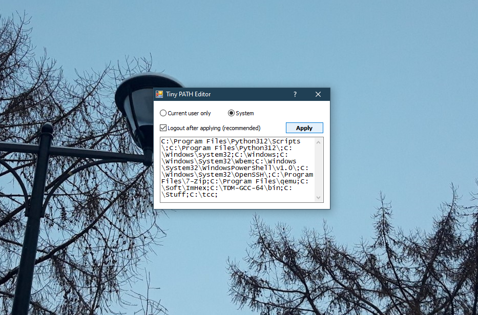

# Tiny PATH Editor

**\[[English](README.md) / [Русский](README-RU.md)\]**

---

**Tiny PATH Editor** is a small system utility which edits Windows `PATH` environment variable. Written in C# just for fun. Visual Studio 2019 is required for building the project. Source code is [Unlicensed](UNLICENSE.txt).

What the hell did I create this... :)

